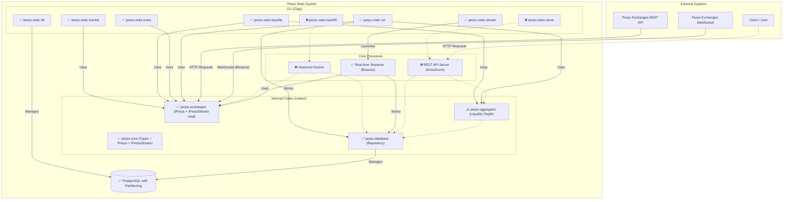

'''# Introduction
This document outlines the recommended project structure, database schema, API design, and core component logic for a Rust implementation of the `perps-stats` service.

# Implementation Status

## Current Implementation Progress

### ✅ Fully Implemented

#### CLI Commands
- **`market`** - Retrieves real-time L1 market data for contracts
- **`liquidity`** - Retrieves liquidity depth data across exchanges
- **`ticker`** - Retrieves comprehensive ticker data with periodic collection support
- **`stream`** - Real-time WebSocket streaming with database storage (Binance only)
- **`run`** - Periodic data collection with CSV/Excel export (combines ticker and liquidity, includes Open Interest columns, uses factory pattern for multi-exchange support)
- **`db init`** - Database initialization with migrations and partitions
- **`db migrate`** - Run database migrations
- **`db stats`** - Show database statistics
- **`db clean`** - Clean old data or truncate tables

#### Exchange Support (All with Symbol Caching)
- **Binance** - Full `IPerps` implementation + `IPerpsStream` WebSocket streaming
- **Bybit** - Full `IPerps` implementation
- **Hyperliquid** - Full `IPerps` implementation
- **KuCoin** - Comprehensive implementation (klines not available from public API)
- **Lighter** - Full `IPerps` implementation
- **Paradex** - Partial implementation (limited public API endpoints)

#### Core Features
- **Symbol Caching** - Thread-safe caching for all exchanges using `OnceCell` and `RwLock`
- **Multi-Exchange Support** - Concurrent data fetching from multiple exchanges
- **Real-time Streaming** - WebSocket streaming with batch database writes (Binance)
- **Excel/CSV Export** - Periodic data collection with multiple output formats
- **Database Schema** - PostgreSQL with daily partitioning for time-series tables
- **Repository Pattern** - Async database operations with `sqlx`
- **Liquidity Depth Calculation** - Cumulative notional at various basis point spreads
- **Factory Pattern** - Exchange client creation via factory module

#### Database Tables
- `exchanges` - Exchange metadata
- `markets` - Market/symbol information
- `tickers` - Ticker snapshots (partitioned)
- `orderbooks` - Liquidity snapshots (partitioned)
- `trades` - Trade records (partitioned)
- `funding_rates` - Funding rate history (partitioned)
- `liquidity_depth` - Liquidity depth statistics (partitioned)
- `open_interest` - Open interest data (partitioned)
- `klines` - OHLCV candlestick data (partitioned, migration created)
- `ingest_events` - Audit table for ingestion tracking

#### Repository Methods (with Exchange Context)
- `store_tickers_with_exchange()`
- `store_trades_with_exchange()`
- `store_orderbooks_with_exchange()`
- `store_funding_rates_with_exchange()`
- `store_open_interest_with_exchange()`
- `store_liquidity_depth()`

### ⚠️ Stub Implementations

#### Repository Methods (Require Exchange Context)
- `store_markets()` - Requires exchange_id, needs specialized implementation
- `store_klines()` - Requires exchange_id, needs specialized implementation
- `store_tickers()` - Use `store_tickers_with_exchange()` instead
- `store_trades()` - Use `store_trades_with_exchange()` instead
- `store_orderbooks()` - Use `store_orderbooks_with_exchange()` instead
- `store_funding_rates()` - Use `store_funding_rates_with_exchange()` instead
- `store_open_interest()` - Use `store_open_interest_with_exchange()` instead

### ❌ Not Yet Implemented

#### CLI Commands
- `backfill` - Historical data backfilling
- `serve` - REST API server

#### Core Components
- Historical Fetcher process
- REST API Server (Actix/Axum)

#### Aggregator Functions
- `calculate_slippage()` - Price impact calculation
- `calculate_market_depth()` - Liquidity analysis at percentage levels
- `calculate_vwap()` - Volume-weighted average price

#### Repository Query Methods
- `get_klines()` - Retrieve historical klines
- `get_tickers()` - Retrieve historical tickers
- `get_trades()` - Retrieve historical trades
- Other query methods for data retrieval

## Next Steps
1. Implement historical backfill command with specialized `store_*_with_exchange()` methods
2. Extend real-time WebSocket streaming to support additional exchanges (currently Binance only)
3. Build REST API server with aggregation endpoints
4. Add query methods to repository for data retrieval
5. Implement remaining aggregator calculations (VWAP, slippage, market depth)

# System Architecture
This diagram illustrates the high-level architecture of the perps-stats system. It shows the main components, their interactions, and the flow of data from external exchanges to the end-user via the API.



## Codebase Structure
The implemented structure separates concerns into distinct crates and applications, promoting modularity and maintainability.
```
perps-stats/
├── Cargo.toml                # Workspace definition for all crates
├── .env                      # Environment variables
├── crates/                   # Shared library crates
│   ├── perps-core/           # Core domain types (Market, Kline, LiquidityDepthStats) and the IPerps trait
│   ├── perps-exchanges/      # Exchange-specific implementations of the IPerps trait
│   │   ├── binance/          # ✅ Fully implemented
│   │   ├── bybit/            # ✅ Fully implemented
│   │   ├── hyperliquid/      # ✅ Fully implemented
│   │   ├── kucoin/           # ✅ Fully implemented
│   │   ├── lighter/          # ✅ Fully implemented
│   │   ├── paradex/          # ⚠️ Partial implementation
│   │   ├── cache.rs          # ✅ Shared symbol caching module
│   │   └── factory.rs        # ✅ Factory for creating exchange clients
│   ├── perps-database/       # Database repository and schema management logic
│   │   ├── repository.rs     # ✅ Repository trait and PostgreSQL implementation
│   │   ├── partitions.rs     # ✅ Partition management functions
│   │   ├── stats.rs          # ✅ Database statistics functions
│   │   └── db.rs             # ✅ Database connection and utilities
│   └── perps-aggregator/     # Business logic for calculated metrics
│       ├── aggregator.rs     # ✅ IAggregator trait with calculate_liquidity_depth
│       └── types.rs          # ✅ MarketDepth and other aggregation types
│
├── src/                      # Main binary crate that defines the CLI
│   ├── main.rs               # ✅ Application entry point
│   ├── cli.rs                # ✅ CLI command definitions (using Clap)
│   ├── commands/             # Modules for subcommand logic
│   │   ├── backfill.rs       # ❌ Not yet implemented
│   │   ├── serve.rs          # ❌ Not yet implemented
│   │   ├── stream.rs         # ✅ Real-time WebSocket streaming with database storage
│   │   ├── run.rs            # ✅ Periodic data collection with Excel/CSV export
│   │   │                     #    - Multi-exchange parallel collection using all_exchanges()
│   │   │                     #    - 20-column ticker output including Open Interest fields
│   │   │                     #    - Output format compatible with ticker and liquidity commands
│   │   │                     #    - Comprehensive unit test coverage
│   │   ├── db.rs             # ✅ Database operations: init, clean, migrate, stats
│   │   ├── market.rs         # ✅ Retrieve L1 market data
│   │   ├── liquidity.rs      # ✅ Retrieve liquidity depth data
│   │   └── ticker.rs         # ✅ Retrieve ticker data
│
└── migrations/               # ✅ SQL migration files (for sqlx-cli)
    ├── 20251010000001_create_exchanges_and_markets.sql
    ├── 20251010000002_create_timeseries_tables.sql
    ├── 20251010000003_create_initial_partitions_and_indexes.sql
    ├── 20251010000004_seed_exchanges.sql
    ├── 20251011000001_create_liquidity_depth_table.sql
    ├── 20251011000002_create_open_interest_table.sql
    └── 20251011000003_create_klines_table.sql
```

# Core Components & Data Flow
## Data Ingestion
Data ingestion is split into two distinct processes: historical backfilling and real-time streaming.

### Historical Fetcher
- **Trigger**. 
  - Manually run via the CLI: `perps-stats fetch --exchange kucoin --symbols BTC,ETH --from 2024-01-01`.
  - Have a service `backfill()` that is called when the application is initialized.
- **Logic**
  - Each client implementing the `IPerps` interface must have this feature to query missing historical data from the past.
  - This client, is used to call methods like `GetKlines` and `GetFundingRateHistory`.
  - The fetcher iterates through the received data (e.g., a slice of `*perps.Kline`).
  - For each data point, it calls a method on the database repository, like repo.StoreKlines(ctx, klines).
  - The database query should be idempotent, using `INSERT ... ON CONFLICT DO NOTHING` to prevent duplicates if the backfill is run multiple times over the same period.

### Real-time Streamer
- **Status**: ✅ **Implemented for Binance**
- **Trigger**.
  - Run as a long-running service: `perps-stats stream --exchange binance --symbols BTC,ETH --data-types ticker,trade,orderbook`.
  - Optional database storage with `--database-url` flag or `DATABASE_URL` env variable.
- **Logic**
  - Uses the `IPerpsStream` trait (defined in `crates/perps-core/src/streaming.rs`) to establish WebSocket connections.
  - Binance implementation (`BinanceWsClient` in `crates/perps-exchanges/src/binance/ws_client.rs`) connects to `wss://fstream.binance.com/ws`.
  - Messages are deserialized into the core Rust structs (`Ticker`, `Trade`, `Orderbook`).
  - Supports multiple data types simultaneously via `stream_multi()` method that returns `StreamEvent` enum.
  - Batch writes to database with configurable batch size (default: 100 events) to avoid overwhelming the system.
  - Separate buffers for each data type (tickers, trades, orderbooks) with automatic flushing on shutdown.
  - Optional `--max-duration` flag to limit streaming time (useful for testing).

## Data Storage
This layer provides a clean abstraction over the database.
- **Technology**. PostgreSQL with the TimescaleDB extension is ideal for handling the time-series nature of market data. TimescaleDB's hypertables will automatically partition your data by time, leading to massive performance gains on queries with time ranges.
- **Schema & Migrations**. Use the `sqlx-cli` tool, which integrates with the `sqlx` crate, to manage migrations.
- **Repository Pattern**.  A Repository trait will define the database operations. The implementation will use the async `sqlx` driver, which provides compile-time query checking for enhanced type safety.

## Data Serving & Aggregation
### REST API Server
- **Trigger**. 
  - Run as a long-running service: `perps-stats serve --port 8080`.
  - Run as a service within the main application.
- **Framework**. Use a high-performance async framework like `actix-web` or `axum`.
- **Logic**. The server initializes a database connection pool `(sqlx::PgPool)` and an `Aggregator` instance, which are shared with the API handlers as application state.
  - The server initializes the database repository and injects it into the API handlers.
  - When a request hits a route, the corresponding handler function is executed.
  - The handler validates query parameters (e.g., interval, start_time), calls the appropriate repository method, and serializes the result into a JSON response.

### Aggregator
The business logic resides in the `perps-aggregator` crate and is defined by an `IAggregator` trait. This package is pure business logic and has no knowledge of databases or APIs.

```rust
// crates/perps-aggregator/src/aggregator.rs
use async_trait::async_trait;
use rust_decimal::Decimal;
use perps_core::{IPerps, LiquidityDepthStats, Orderbook, OrderSide, Trade};

#[async_trait]
pub trait IAggregator: Send + Sync {
    // ... other methods

    /// Analyzes an order book to determine the cumulative notional value
    /// available at different basis point spreads from the mid-price.
    async fn calculate_liquidity_depth(
        &self,
        book: &Orderbook,
        exchange: &str,
    ) -> anyhow::Result<LiquidityDepthStats>;

    /// Calculates liquidity depth for a given symbol across multiple exchanges concurrently.
    async fn calculate_liquidity_depth_all(
        &self,
        exchanges: &[Box<dyn IPerps + Send + Sync>],
        symbol: &str,
    ) -> anyhow::Result<Vec<LiquidityDepthStats>>;
}
```

For example, the handler for a slippage request would first fetch the order book from the database, then pass it to the aggregator for calculation.

```rust
// Simplified example of the slippage calculation function
pub fn calculate_slippage(book: &Orderbook, trade_size: Decimal, side: OrderSide) -> Result<Decimal> {
    // ... logic to walk the order book bids or asks ...
    // ... calculate the average execution price ...
    // ... compare to the mark price to find slippage percentage ...
    Ok(slippage)
}
```

# Interfaces & Data Structure

## Streaming Interface

### IPerpsStream Trait
The `IPerpsStream` trait (`crates/perps-core/src/streaming.rs`) defines the interface for real-time WebSocket streaming from exchanges.

```rust
// crates/perps-core/src/streaming.rs
use async_trait::async_trait;
use futures::Stream;
use std::pin::Pin;

pub type DataStream<T> = Pin<Box<dyn Stream<Item = anyhow::Result<T>> + Send>>;

#[derive(Debug, Clone)]
pub enum StreamEvent {
    Ticker(Ticker),
    Trade(Trade),
    Orderbook(Orderbook),
    FundingRate(FundingRate),
}

#[derive(Debug, Clone)]
pub enum StreamDataType {
    Ticker,
    Trade,
    Orderbook,
    FundingRate,
}

#[derive(Debug, Clone)]
pub struct StreamConfig {
    pub symbols: Vec<String>,
    pub data_types: Vec<StreamDataType>,
    pub auto_reconnect: bool,
}

#[async_trait]
pub trait IPerpsStream: Send + Sync {
    /// Returns the name of the exchange
    fn get_name(&self) -> &str;

    /// Stream real-time ticker updates for specified symbols
    async fn stream_tickers(&self, symbols: Vec<String>) -> anyhow::Result<DataStream<Ticker>>;

    /// Stream real-time trade updates for specified symbols
    async fn stream_trades(&self, symbols: Vec<String>) -> anyhow::Result<DataStream<Trade>>;

    /// Stream real-time orderbook updates for specified symbols
    async fn stream_orderbooks(&self, symbols: Vec<String>) -> anyhow::Result<DataStream<Orderbook>>;

    /// Stream multiple data types simultaneously
    async fn stream_multi(&self, config: StreamConfig) -> anyhow::Result<DataStream<StreamEvent>>;
}
```

**Implementation Notes**:
- Currently implemented for Binance only (`BinanceWsClient`)
- Uses `async_stream` macro for ergonomic async stream creation
- Returns type-erased pinned streams for flexibility
- Supports multiplexing multiple data types in a single WebSocket connection via `stream_multi()`

## REST API Interface

### IPerps Trait
The `IPerps` trait (`crates/perps-core/src/traits.rs`) defines the interface for REST API operations.
```rust
// crates/perps-core/src/traits.rs
use crate::types::*;
use async_trait::async_trait;
use chrono::{DateTime, Utc};

#[async_trait]
pub trait IPerps: Send + Sync {
    /// GetName returns the name of the exchange.
    fn get_name(&self) -> &str;

    /// Parses a global symbol into an exchange-specific symbol.
    fn parse_symbol(&self, symbol: &str) -> String;

    /// GetMarkets returns all available perpetual markets on the exchange.
    async fn get_markets(&self) -> anyhow::Result<Vec<Market>>;

    /// GetMarket returns detailed information about a specific market.
    async fn get_market(&self, symbol: &str) -> anyhow::Result<Market>;

    /// GetTicker returns the current ticker information for a market.
    async fn get_ticker(&self, symbol: &str) -> anyhow::Result<Ticker>;

    /// GetAllTickers returns ticker information for all markets.
    async fn get_all_tickers(&self) -> anyhow::Result<Vec<Ticker>>;

    /// GetOrderbook returns the order book for a market.
    async fn get_orderbook(&self, symbol: &str, depth: u32) -> anyhow::Result<Orderbook>;

    /// GetFundingRate returns the current and predicted funding rate for a market.
    async fn get_funding_rate(&self, symbol: &str) -> anyhow::Result<FundingRate>;

    /// GetFundingRateHistory returns historical funding rates for a market.
    async fn get_funding_rate_history(
        &self,
        symbol: &str,
        start_time: Option<DateTime<Utc>>,
        end_time: Option<DateTime<Utc>>,
        limit: Option<u32>,
    ) -> anyhow::Result<Vec<FundingRate>>;

    /// GetOpenInterest returns the current open interest for a market.
    async fn get_open_interest(&self, symbol: &str) -> anyhow::Result<OpenInterest>;

    /// GetKlines returns candlestick/kline data for a market.
    async fn get_klines(
        &self,
        symbol: &str,
        interval: &str,
        start_time: Option<DateTime<Utc>>,
        end_time: Option<DateTime<Utc>>,
        limit: Option<u32>,
    ) -> anyhow::Result<Vec<Kline>>;

    /// GetRecentTrades returns recent public trades for a market.
    async fn get_recent_trades(&self, symbol: &str, limit: u32) -> anyhow::Result<Vec<Trade>>;

    /// GetMarketStats returns aggregated market statistics.
    async fn get_market_stats(&self, symbol: &str) -> anyhow::Result<MarketStats>;

    /// GetAllMarketStats returns aggregated statistics for all markets.
    async fn get_all_market_stats(&self) -> anyhow::Result<Vec<MarketStats>>;

    /// IsSupported checks if a symbol is supported by the exchange.
    async fn is_supported(&self, symbol: &str) -> anyhow::Result<bool>;
}
```
- Perps Data Structures (`crates/perps-core/src/types.rs`)
```rust
// crates/perps-core/src/types.rs
use chrono::{DateTime, Utc};
use rust_decimal::Decimal;
use serde::{Deserialize, Serialize};

#[derive(Debug, Clone, Serialize, Deserialize)]
pub enum OrderSide {
    Buy,
    Sell,
}

#[derive(Debug, Clone, Serialize, Deserialize)]
pub struct Market {
    pub symbol: String,
    pub contract: String,
    pub contract_size: Decimal,
    pub price_scale: i32,
    pub quantity_scale: i32,
    pub min_order_qty: Decimal,
    pub max_order_qty: Decimal,
    pub min_order_value: Decimal,
    pub max_leverage: Decimal,
}

#[derive(Debug, Clone, Serialize, Deserialize)]
pub struct Ticker {
    pub symbol: String,
    pub last_price: Decimal,
    pub mark_price: Decimal,
    pub index_price: Decimal,
    pub best_bid_price: Decimal,
    pub best_bid_qty: Decimal,
    pub best_ask_price: Decimal,
    pub best_ask_qty: Decimal,
    pub volume_24h: Decimal,
    pub turnover_24h: Decimal,
    pub price_change_24h: Decimal,
    pub price_change_pct: Decimal,
    pub high_price_24h: Decimal,
    pub low_price_24h: Decimal,
    pub timestamp: DateTime<Utc>,
}

#[derive(Debug, Clone, Serialize, Deserialize)]
pub struct OrderbookLevel {
    pub price: Decimal,
    pub quantity: Decimal,
}

#[derive(Debug, Clone, Serialize, Deserialize)]
pub struct Orderbook {
    pub symbol: String,
    pub bids: Vec<OrderbookLevel>,
    pub asks: Vec<OrderbookLevel>,
    pub timestamp: DateTime<Utc>,
}

#[derive(Debug, Clone, Serialize, Deserialize)]
pub struct FundingRate {
    pub symbol: String,
    pub funding_rate: Decimal,
    pub predicted_rate: Decimal,
    pub funding_time: DateTime<Utc>,
    pub next_funding_time: DateTime<Utc>,
    pub funding_interval: i32, // in hours
    pub funding_rate_cap_floor: Decimal,
}

#[derive(Debug, Clone, Serialize, Deserialize)]
pub struct OpenInterest {
    pub symbol: String,
    pub open_interest: Decimal,
    pub open_value: Decimal,
    pub timestamp: DateTime<Utc>,
}

#[derive(Debug, Clone, Serialize, Deserialize)]
pub struct Kline {
    pub symbol: String,
    pub interval: String,
    pub open_time: DateTime<Utc>,
    pub close_time: DateTime<Utc>,
    pub open: Decimal,
    pub high: Decimal,
    pub low: Decimal,
    pub close: Decimal,
    pub volume: Decimal,
    pub turnover: Decimal,
}

#[derive(Debug, Clone, Serialize, Deserialize)]
pub struct Trade {
    pub id: String,
    pub symbol: String,
    pub price: Decimal,
    pub quantity: Decimal,
    pub side: OrderSide,
    pub timestamp: DateTime<Utc>,
}

#[derive(Debug, Clone, Serialize, Deserialize)]
pub struct MarketStats {
    pub symbol: String,
    pub volume_24h: Decimal,
    pub turnover_24h: Decimal,
    pub open_interest: Decimal,
    pub funding_rate: Decimal,
    pub last_price: Decimal,
    pub mark_price: Decimal,
    pub index_price: Decimal,
    pub price_change_24h: Decimal,
    pub price_change_pct: Decimal,
    pub high_price_24h: Decimal,
    pub low_price_24h: Decimal,
    pub timestamp: DateTime<Utc>,
}

/// Represents total notional (price × qty) available within fixed spread
/// thresholds (in basis points) for both bid and ask sides.
#[derive(Debug, Clone, Serialize, Deserialize, Default)]
pub struct LiquidityDepthStats {
  pub timestamp: DateTime<Utc>, // Timestamp of the snapshot
  pub exchange: String,
  pub symbol: String,
  pub mid_price: Decimal,

  // Bid notionals
  pub bid_1bps: Decimal,
  pub bid_2_5bps: Decimal,
  pub bid_5bps: Decimal,
  pub bid_10bps: Decimal,
  pub bid_20bps: Decimal,

  // Ask notionals
  pub ask_1bps: Decimal,
  pub ask_2_5bps: Decimal,
  pub ask_5bps: Decimal,
  pub ask_10bps: Decimal,
  pub ask_20bps: Decimal,
}
```
- Aggregator Data Structures (`crates/perps-aggregator/src/types.rs`)
```rust
// crates/perps-aggregator/src/types.rs
use chrono::{DateTime, Utc};
use rust_decimal::Decimal;
use serde::{Deserialize, Serialize};

#[derive(Debug, Clone, Serialize, Deserialize)]
pub struct DepthLevel {
    // e.g., 0.005 for 0.5%
    pub percentage: Decimal,
    // Cumulative quantity of bids within this percentage
    pub bid_volume: Decimal,
    // Cumulative quantity of asks within this percentage
    pub ask_volume: Decimal,
}

#[derive(Debug, Clone, Serialize, Deserialize)]
pub struct MarketDepth {
    pub symbol: String,
    pub timestamp: DateTime<Utc>,
    pub levels: Vec<DepthLevel>,
}
```
'''